# FuckingRosLatency

本仓库用于比较 ROS 2 与 LibXR 在图像消息链路上的延迟和 CPU 占用。

当前比较关系如下：

- ROS 2 `intra-process`
  对应 LibXR 普通 `Topic`
- ROS 2 多进程 pub/sub
  对应 `LibXR::LinuxSharedTopic`

默认构建模式为 `Release`。所有测试都在图像帧填充完成后再打时间戳，所以结果不包含帧填充时间。

## 目录

```text
auto_bench_image_latency.sh
auto_bench_libxr_image_latency.sh
README.md
README_en.md
src/
  image_latency_test/
  libxr_bench/
    CMakeLists.txt
    package.xml
    libxr/
    main.cpp
```

## ROS 2 基准

`src/image_latency_test/` 提供两条 ROS 2 基准线：

- 多进程 pub/sub
  发布节点和订阅节点分开运行，统计 `stamp -> subscriber callback`
- `intra_process_image_latency`
  发布和订阅在同一进程，统计 `stamp -> subscriber callback`

运行脚本：

```bash
source /opt/ros/humble/setup.bash
export WS=$HOME/ros2_ws
./auto_bench_image_latency.sh
```

可选环境变量：

- `WS`
- `DURATION`
- `RATE`
- `WIDTH`
- `HEIGHT`

## LibXR 基准

`src/libxr_bench/main.cpp` 同时包含两条 LibXR 基准线：

1. 普通 `Topic`
   同进程 callback subscriber，统计 `Publish -> Callback`
2. `LinuxSharedTopic`
   父进程 publish，子进程 `Wait(data)`，统计 `Publish -> Wait OK`

运行脚本：

```bash
source /opt/ros/humble/setup.bash
export WS=$HOME/ros2_ws
./auto_bench_libxr_image_latency.sh
```

脚本功能：

- 以 `Release` 模式构建或复用 `install/libxr_bench/bin/libxr_bench`
- 抽取 `[RESULT]` 行
- 用 `pidstat -C libxr_bench` 统计整个 LibXR benchmark 运行期间的总 CPU 占用
- 导出原始样本并生成对应 SVG 箱线图

## 最新结果

ROS 2 数据：

- GitHub Actions
  `https://github.com/Jiu-xiao/FuckingRosLatency/actions/runs/24376643892/job/71191462775`

LibXR 数据来自同一次 GitHub Actions 运行。

### 1440×1080

| 类别 | 指标 | 结果 |
|---|---|---|
| ROS 2 多进程 | sub latency | `3.118 ms` |
| ROS 2 `intra-process` | latency | `0.027 ms` |
| LibXR `Topic` | `Publish -> Callback` | `0.718 us` |
| LibXR `LinuxSharedTopic` | `Publish -> Wait OK` | `46.010 us` |

### 320×240

| 类别 | 指标 | 结果 |
|---|---|---|
| ROS 2 多进程 | sub latency | `0.253 ms` |
| ROS 2 `intra-process` | latency | `0.025 ms` |
| LibXR `Topic` | `Publish -> Callback` | `0.872 us` |
| LibXR `LinuxSharedTopic` | `Publish -> Wait OK` | `42.532 us` |

### CPU

| 类别 | 结果 |
|---|---|
| ROS 2 多进程 1440×1080 | pub `8.76 %`, sub `4.07 %` |
| ROS 2 `intra-process` 1440×1080 | `1.07 %` |
| ROS 2 多进程 320×240 | pub `0.62 %`, sub `0.59 %` |
| ROS 2 `intra-process` 320×240 | `0.31 %` |
| LibXR benchmark 总 CPU | `1.12 %` |

## 箱线图

以下 SVG 箱线图来自本次 CI 产物，已整理到仓库内：

### 1440×1080 延迟

ROS 2 多进程：

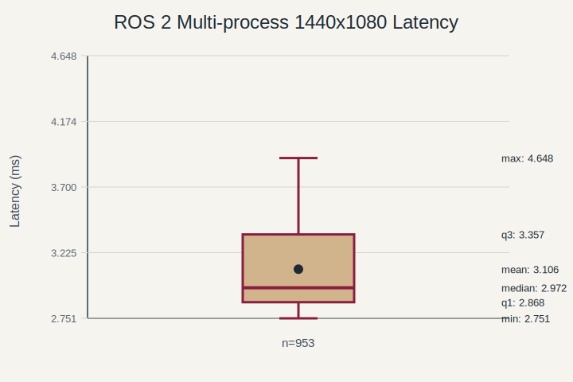

ROS 2 `intra-process`：

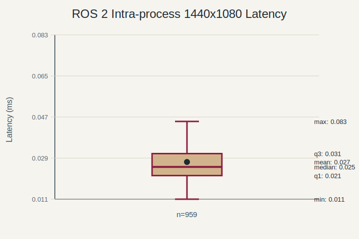

LibXR `Topic`：

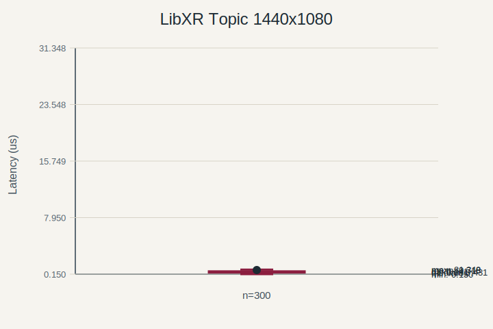

`LinuxSharedTopic`：

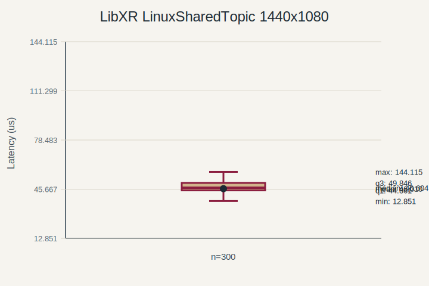

### 320×240 延迟

ROS 2 多进程：

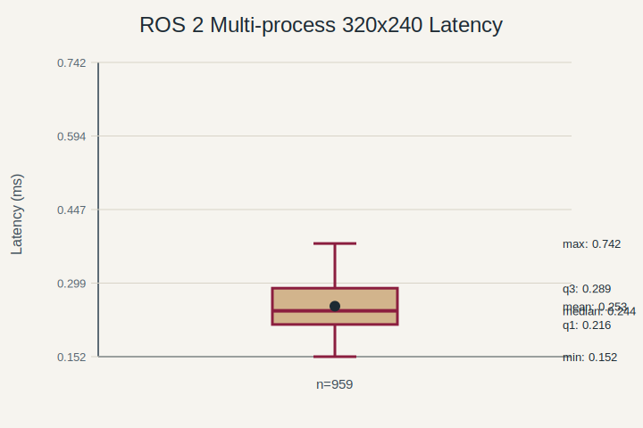

ROS 2 `intra-process`：

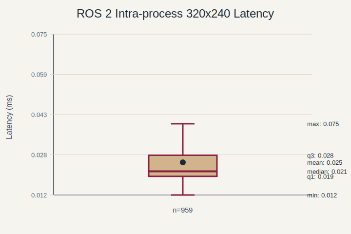

LibXR `Topic`：

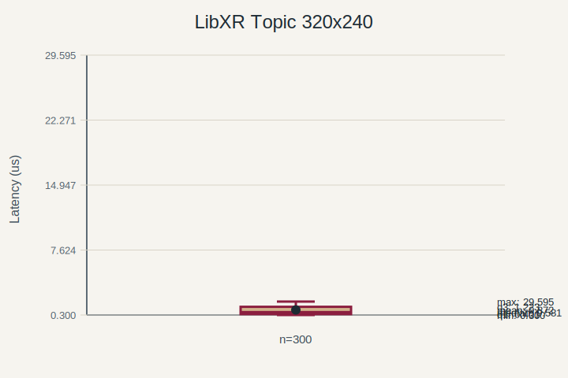

`LinuxSharedTopic`：

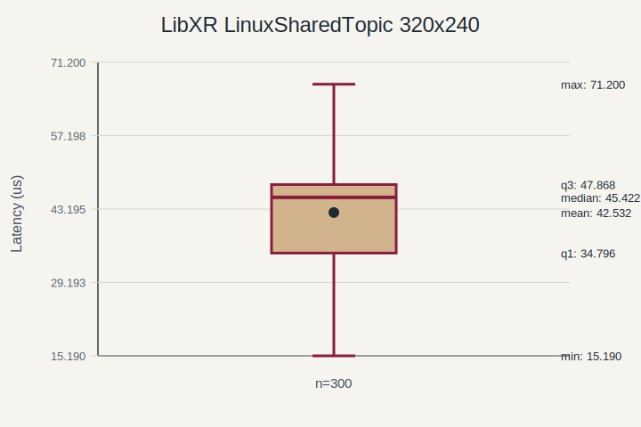

### CPU

ROS 2 多进程 publisher 1440×1080：

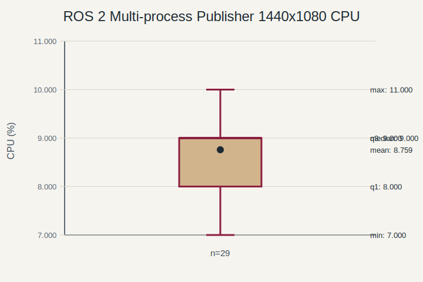

ROS 2 多进程 subscriber 1440×1080：

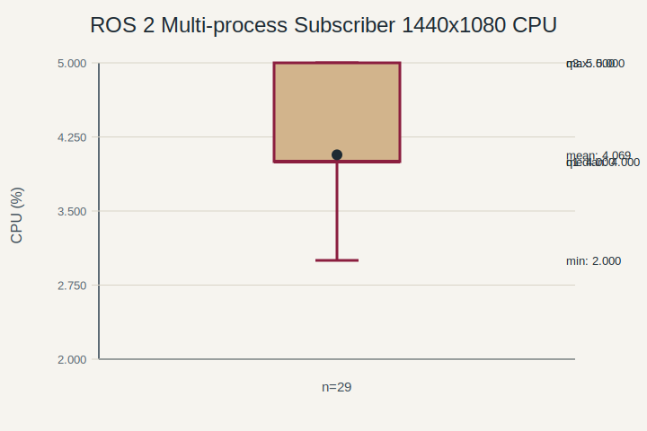

ROS 2 `intra-process` 1440×1080：

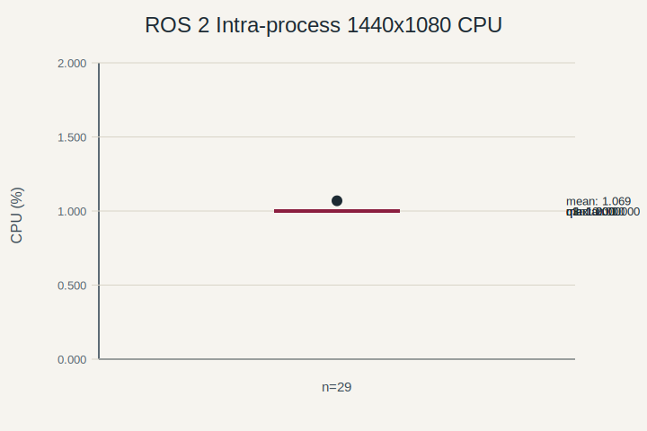

ROS 2 多进程 publisher 320×240：

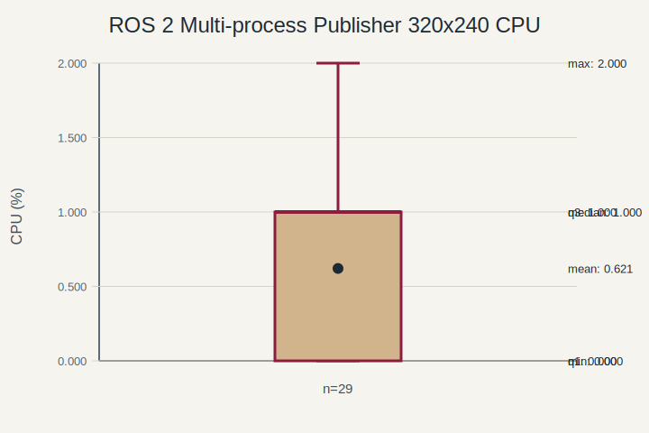

ROS 2 多进程 subscriber 320×240：

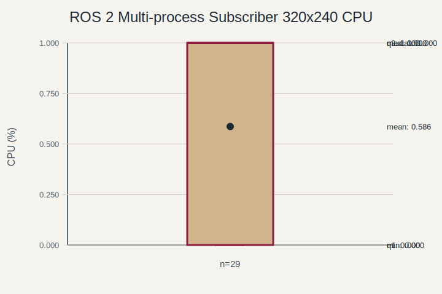

ROS 2 `intra-process` 320×240：

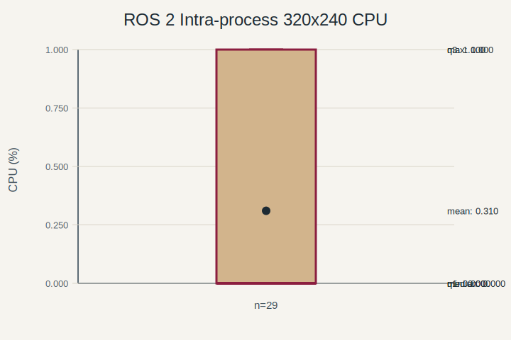

LibXR benchmark 总 CPU：

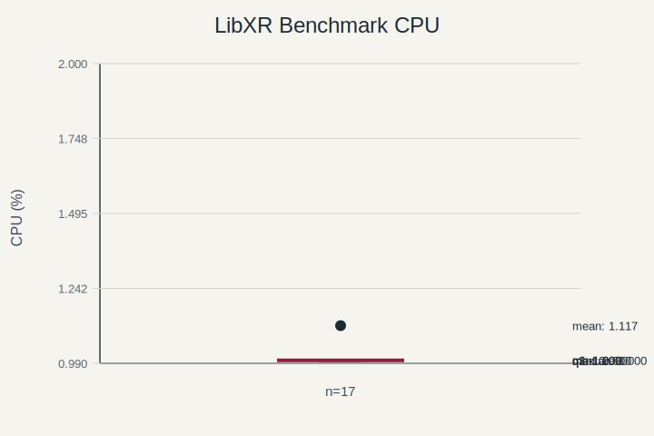

## 结论

- 在进程内消息路径下，普通 `Topic` 的延迟低于 ROS 2 `intra-process`
- 在跨进程消息路径下，`LinuxSharedTopic` 的延迟低于 ROS 2 多进程链路
- `LinuxSharedTopic` 的设计目标不是替代 ROS 2 `intra-process`
- 普通 `Topic` 与 `LinuxSharedTopic` 分别对应进程内、跨进程两类场景
